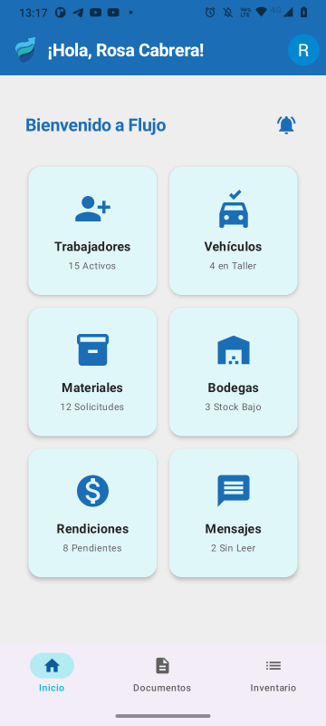
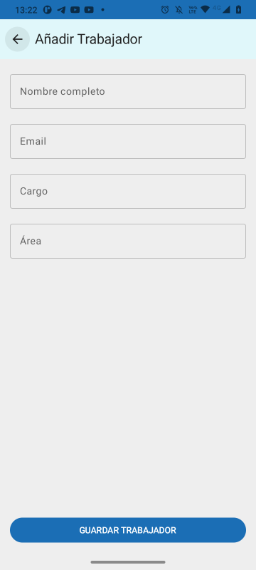
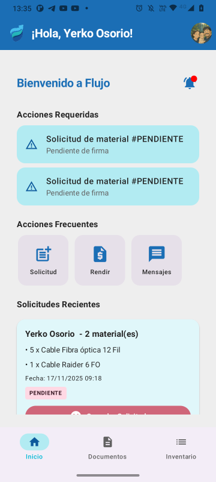
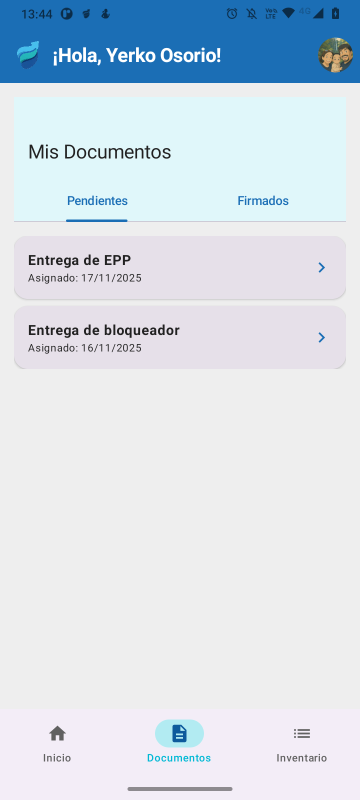
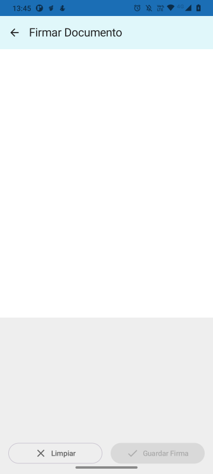
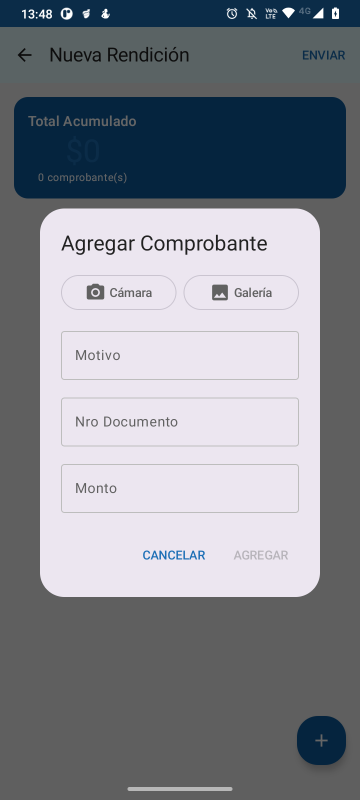

<div align="center">

<p align="center">
  
</p>
# 📱 FlujoApp

### Plataforma de Gestión Empresarial Mobile-First

*Reemplaza el caos por orden en las operaciones en terreno*

[](https://kotlinlang.org/)
[](https://developer.android.com/jetpack/compose)
[](https://firebase.google.com/)
[](LICENSE)

</div>

---

## 🎯 La Solución que Necesitas

Para pequeñas empresas de contratistas y telecomunicaciones ahogadas en planillas, carpetas y grupos de WhatsApp, **FlujoApp** es la plataforma todo-en-uno que ordena tus operaciones en terreno.

### ❌ El Problema

- 📊 **Inventario descontrolado**: Excel desactualizado, solicitudes por WhatsApp
- 🧾 **Gastos perdidos**: Boletas arrugadas, rendiciones caóticas
- 📄 **Papeleo infinito**: Documentos físicos, firmas manuales
- 💬 **Comunicación dispersa**: Múltiples grupos, información perdida

### ✅ La Solución FlujoApp

Centraliza **4 operaciones críticas** en una sola app móvil:

<div align="center">

| 📦 Inventario Inteligente | 💰 Gastos Digitales |
|:-------------------------:|:-------------------:|
| Solicitudes desde móvil<br>Gestión de stock en tiempo real<br>Aprobaciones con un toque | Sube fotos de gastos<br>Aprobación/Rechazo instantáneo<br>Adiós a boletas perdidas |

| 📝 Documentos Sin Papel | 🔔 Comunicación Centralizada |
|:-----------------------:|:----------------------------:|
| Firma digital en pantalla<br>Protocolos de seguridad<br>Guías de despacho | Mensajería interna<br>Notificaciones push<br>Sin grupos personales |

</div>

---

## ✨ Características Destacadas

### 🎯 **Proactiva**
Dashboards orientados a la acción. No es un almacén de datos, es tu asistente: *"2 documentos por firmar"*, *"1 mensaje sin leer"*.

### 📱 **Mobile-First**
Diseñada para trabajar en terreno:
- Temas claro/oscuro para cualquier condición de luz
- Respeta el tamaño de fuente del usuario
- Interfaz moderna con Material Design 3

### 🔒 **Segura y Confiable**
- **RBAC**: Control de acceso basado en roles (Administrador/Trabajador)
- **Transacciones atómicas**: Garantiza integridad del inventario
- **Provisión por invitación**: Solo usuarios autorizados acceden
- **Reglas de seguridad robustas**: Validaciones en cliente y servidor

---

## 🏗️ Arquitectura Técnica

### Stack Tecnológico

```
Frontend (Android)
├── 100% Kotlin
├── Jetpack Compose (UI Moderna)
├── MVVM + Clean Architecture
├── Hilt (Inyección de Dependencias)
├── Coroutines + Flow (Asincronía)
└── Material Design 3

Backend (Firebase)
├── Cloud Firestore (NoSQL)
├── Firebase Auth (Google Sign-In)
├── Cloud Functions (TypeScript)
├── Firebase Storage
├── Cloud Messaging (FCM)
└── Región: southamerica-west1
```

### Principios de Diseño

✅ **Clean Architecture**: Separación clara de capas (Data, Domain, UI)  
✅ **Seguridad por Diseño**: RBAC implementado desde el día 1  
✅ **Integridad de Datos**: Transacciones atómicas para operaciones críticas  
✅ **Código Documentado**: KDoc en interfaces y funciones críticas  
✅ **Manejo de Errores Robusto**: Try-catch exhaustivos con mensajes descriptivos

---

## 📊 Módulos Implementados

### 👥 Gestión de Usuarios
- Sistema de invitaciones (solo por admin)
- Provisión automática y segura de cuentas
- Perfiles con foto, datos personales y fechas importantes

### 📦 Inventario Inteligente
- Materiales con categorías y unidades
- Bodegas fijas y móviles (asignadas a vehículos)
- Flujo completo de solicitud → aprobación → entrega
- Vista consolidada de inventario por bodega

### 💸 Rendición de Gastos
- Creación de informes con múltiples ítems
- Captura de fotos de boletas
- Estados: Pendiente → Aprobado/Rechazado
- Historial completo de gastos

### 📄 Documentos Digitales
- Plantillas de documentos (PDFs)
- Asignación a trabajadores
- Firma digital capturada en pantalla
- Estados: Pendiente → Asignado → Firmado

### 💬 Mensajería Interna
- Admin → Trabajador (individual)
- Admin → Todos los trabajadores (broadcast)
- Notificaciones push
- Estado: No leído / Leído

### 🚗 Gestión de Vehículos
- Registro de vehículos con patentes y detalles
- Asignación de bodegas móviles
- Base para futuros módulos de mantenimiento

---

## 📸 Capturas de Pantalla

<div align="center">

### Vista Administrador

| Dashboard | Gestión de Trabajadores | Inventario |
|:---------:|:-----------------------:|:----------:|
|  |  |  |

### Vista Trabajador

| Dashboard | Solicitud de Material | Documentos |
|:---------:|:---------------------:|:----------:|
|  |  |  |

### Gestión Documental

| Firma Digital | Rendición de Gastos | Mensajería |
|:-------------:|:-------------------:|:----------:|
|  |  |  |

</div>

---

## 🚀 Comenzando

### Prerrequisitos

- Android Studio Hedgehog o superior
- JDK 17+
- SDK mínimo: Android 8.0 (API 26)
- Cuenta de Firebase

### Configuración

1. **Clona el repositorio**
```bash
git clone https://github.com/yerkoppp/FlujoApp.git
cd FlujoApp
```

2. **Configura Firebase**
   - Crea un proyecto en [Firebase Console](https://console.firebase.google.com/)
   - Descarga `google-services.json` y colócalo en `/app`
   - Habilita Authentication (Google Sign-In)
   - Crea la base de datos Firestore
   - Configura Storage y Cloud Functions

3. **Despliega las Cloud Functions**
```bash
cd functions
npm install
firebase deploy --only functions
```

4. **Construye la app**
```bash
./gradlew assembleDebug
```

### Estructura del Proyecto

```
app/
├── data/                    # Capa de datos
│   ├── repository/          # Implementaciones de repositorios
│   └── preferences/         # DataStore
├── domain/                  # Capa de negocio
│   ├── model/               # 15 modelos de dominio
│   └── repository/          # 7 interfaces de repositorios
├── di/                      # Inyección de dependencias (Hilt)
├── ui/                      # Capa de presentación
│   ├── screens/             # Pantallas organizadas por módulo
│   └── navigation/          # Navegación
└── utils/                   # Utilidades (Resource, Extensions)

functions/                   # Cloud Functions (TypeScript)
├── src/
│   └── index.ts             # Funciones: createWorker, provisionUserAccount, etc.
└── firestore.rules          # Reglas de seguridad de Firestore
```

---

## 🎓 Arquitectura Detallada

### Clean Architecture + MVVM

```
┌─────────────────────────────────────────┐
│           UI Layer (Compose)            │
│  ┌─────────────────────────────────┐   │
│  │   Screens & ViewModels (MVVM)   │   │
│  └─────────────────────────────────┘   │
└────────────────┬────────────────────────┘
                 │ StateFlow/Flow
┌────────────────▼────────────────────────┐
│        Domain Layer (Use Cases)         │
│  ┌─────────────────────────────────┐   │
│  │   Repository Interfaces         │   │
│  └─────────────────────────────────┘   │
└────────────────┬────────────────────────┘
                 │
┌────────────────▼────────────────────────┐
│           Data Layer                    │
│  ┌─────────────────────────────────┐   │
│  │  Repository Implementations     │   │
│  │  (Firestore, Storage, Auth)     │   │
│  └─────────────────────────────────┘   │
└─────────────────────────────────────────┘
```

### Seguridad: RBAC Implementado

**Roles:**
- `ADMINISTRADOR`: Acceso total, puede crear usuarios, aprobar solicitudes, gestionar inventario
- `TRABAJADOR`: Acceso limitado, puede crear solicitudes, reportar gastos, firmar documentos

**Implementación:**
- Reglas de Firestore validan el rol en cada operación
- Funciones helper: `isAdmin()`, `isWorker()`
- Cloud Functions verifican autenticación y roles
- Campos inmutables protegidos (ej. `role`, `companyId`)

---

## 📈 Roadmap

### ✅ Fase 1: MVP (Actual)
- [x] Sistema de autenticación y provisión
- [x] Gestión de inventario con transacciones
- [x] Rendición de gastos digital
- [x] Documentos y firmas digitales
- [x] Mensajería y notificaciones
- [x] Dashboards diferenciados por rol

### 🔄 Fase 2: Optimización (Próximos 2 meses)
- [ ] Implementar paginación (Jetpack Paging 3)
- [ ] Caché offline (Room)
- [ ] Carga de imágenes (Coil)
- [ ] Testing completo (JUnit, Mockito)
- [ ] CI/CD con GitHub Actions
- [ ] Crashlytics y Analytics

### 🚀 Fase 3: Expansión (3-6 meses)
- [ ] Notificaciones expandidas (asignación, aprobaciones)
- [ ] Gestión completa de vehículos (mantenimientos, kilometraje)
- [ ] Documentos mejorados (estampar firma en PDF)
- [ ] Tipos de inventario (Consumible, Herramienta, Ropa)
- [ ] Dashboard de analítica para admins
- [ ] Automatización de bienestar (cumpleaños, aniversarios)

### 🌟 Fase 4: Enterprise (6-12 meses)
- [ ] Multi-empresa (tenant isolation)
- [ ] Reportes avanzados y exportación
- [ ] Integraciones con ERP contables
- [ ] Versión web (desktop)
- [ ] Modo offline completo con sincronización
- [ ] Roles personalizados (supervisor, bodeguero)

---

## 🔧 Configuración Avanzada

### Firestore Rules

El archivo `firestore.rules` implementa RBAC estricto:

```javascript
function isAdmin() {
  return get(/databases/$(database)/documents/users/$(request.auth.uid)).data.role == 'ADMINISTRADOR';
}

function isWorker() {
  return get(/databases/$(database)/documents/users/$(request.auth.uid)).data.role == 'TRABAJADOR';
}
```

### Cloud Functions Disponibles

| Función | Descripción | Validaciones |
|---------|-------------|--------------|
| `createWorker` | Crea invitación para nuevo trabajador | Solo admin, valida email |
| `provisionUserAccount` | Provisiona cuenta tras autenticación | Verifica invitación, atómico |
| `deliverMaterialRequest` | Entrega material (transacción) | Valida stock, actualiza bodegas |

---

## 🤝 Contribuir

Las contribuciones son bienvenidas. Por favor:

1. Fork el proyecto
2. Crea una rama para tu feature (`git checkout -b feature/AmazingFeature`)
3. Commit tus cambios (`git commit -m 'Add AmazingFeature'`)
4. Push a la rama (`git push origin feature/AmazingFeature`)
5. Abre un Pull Request

### Código de Conducta
- Código limpio y documentado
- Tests para nuevas funcionalidades
- Seguir los principios de Clean Architecture
- Respetar las convenciones de Kotlin

---

## 📝 Licencia

Este proyecto está bajo la Licencia MIT. Ver archivo `LICENSE` para más detalles.

---

## 👨‍💻 Autor

**Yerko Osorio**

- GitHub: [@yerkoppp](https://github.com/yerkoppp)
- Email: ycosorio.dev@gmail.com

---

## 🙏 Agradecimientos

- Equipo de Android Developers
- Comunidad de Firebase
- Empresas contratistas que inspiraron esta solución

---

<div align="center">

### ⭐ Si FlujoApp te resulta útil, considera darle una estrella

**[Reportar Bug](https://github.com/yerkoppp/FlujoApp/issues)** • **[Solicitar Feature](https://github.com/yerkoppp/FlujoApp/issues)** • **[Documentación](https://github.com/yerkoppp/FlujoApp/wiki)**

</div>

---

## 📊 Estadísticas del Proyecto


